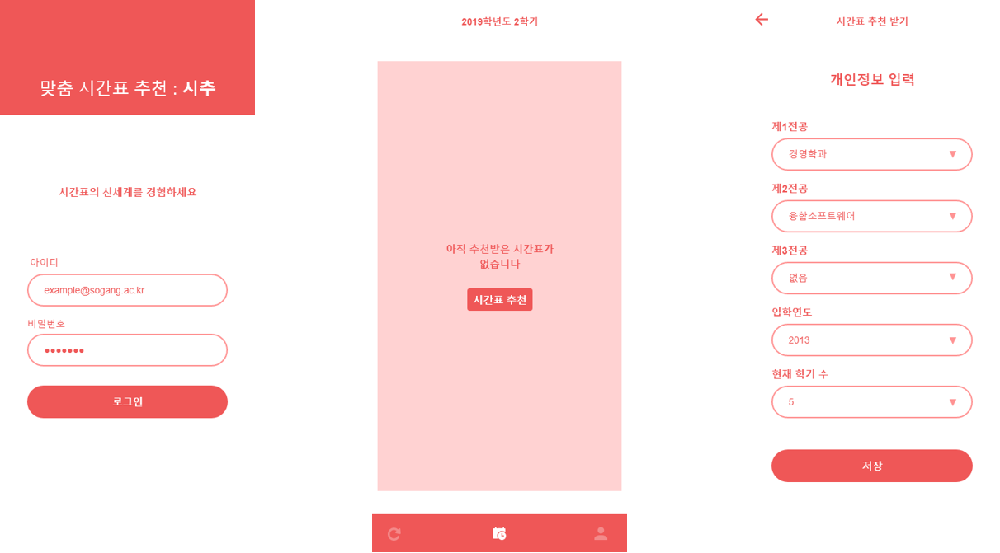
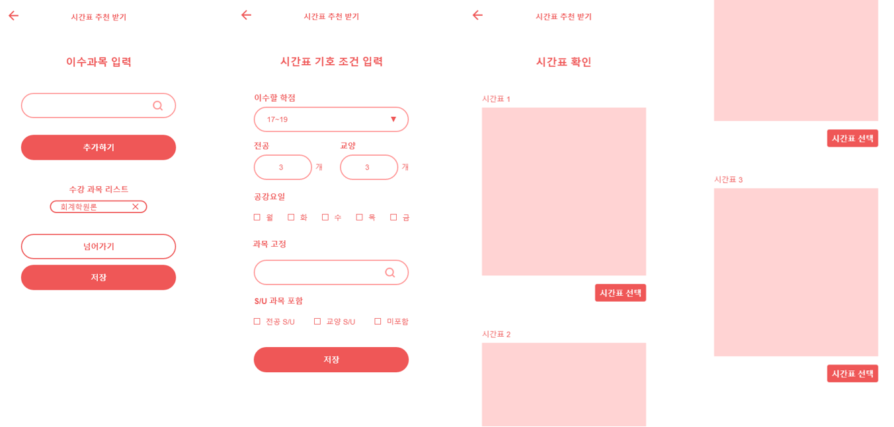

# 시추(시간표 추천 서비스)

융합소프트웨어 종합설계 수업 2팀 프로젝트 (2019.09~12)

### 프로젝트 요약

학생의 전공과 학기, 시간표 조건을 고려하여 수업시간표를 추천해주는 서비스

### 프로젝트 진행 과정

- 아이디어 선정 및 프로젝트 수행 계획서 작성
- Use Case, GUI, Initial Data를 포함한 SRS(Software Requirement Specification) 작성
- Key Class Design, Table Design, Sequence Diagram을 포함한 SAD(Software Architecture Documentation) 작성

### 주요 구현 사항

- sequelize를 활용한 ORM 적용
- MVC 패턴 적용
- `ejs template engine`을 활용한 서버사이드 렌더링
- **SVD(Singular Value Decomposition) 개념을 활용한 시간표 패턴 분석 및 후보 시간표 제시**

### 기술 스택

- express (node js)
- MySQL
- HTML, CSS, Javscript(jQuery)

### DB 설계

### 주요 화면

